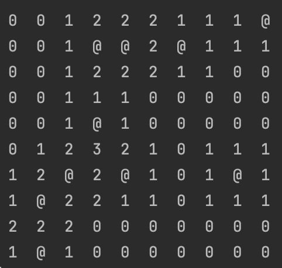

# 지뢰찾기 맵 출력

## 1. 맵 초기화

* 10x10 board를 0으로 초기화
  * 지뢰(@)표현을 위해 char로 선언

## 2. 지뢰 생성

### 2.1 0~9 값을 가지는 x와 y를 각각 Math.random()으로 생성

* 해당 x,y 에 대한 지뢰가 존재하지 않을때 까지 수행

### 2.2 해당 x,y를 지뢰로 설정하고 주위블럭의 값을 1씩 증가

* 주위 8칸을 순회
* 순회 중인 x,y 에 대한 유효성 평가(배열 범위, 지뢰 여부)
* 유효하면 값을 1증가

## 3. 출력

* 반복문을 통해 출력

## 지뢰 찾기 완성본 코드

[https://github.com/youngwonseo/mine-finder](https://github.com/youngwonseo/mine-finder)